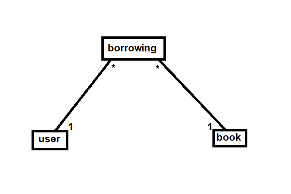

# Library API using .Net 10
This project was part of a technical interview.

## Instructions
Vašou úlohou je vytvoriť API endpointy pre správu vypožičaných kníh.

Požiadavky:
- Vytvorte ASP.NET Core aplikáciu pre správu vypožičaných kníh.
- Použite databázové modely pre používateľov a knihy a dátovú vrstvu, ktorá umožní komunikáciu s databázou (napr. použitie Entity Framework Core).
- Endpointy by mali podporovať:
    - Vytvorenie novej knihy
    - Získanie detailov existujúcej knihy podľa ID
    - Aktualizáciu existujúcej knihy
    - Odstránenie knihy
    - Vytvorenie novej zápožičky
    - Potvrdenie o vrátení vypožičanej knihy
- Zabezpečte validáciu vstupných údajov.

Bonusové úlohy:
- Pokrytie kódu testami (unit testy, integračné testy).
- Implementuje funkcionalitu automatickeho odoslania pripomienky používateľovi deň pred uplynutím termínu na vrátenie knihy. (odoslanie emailu nafejkujte)

Poznámka pre hodnotenie:
- Hodnotiť sa bude nielen funkčnosť a správne fungovanie API endpointov, ale aj kvalita kódu, dodržiavanie najlepších praktík, štruktúra projektu a schopnosť vysvetliť a obhájiť rozhodnutia pri dizajne a implementácii riešenia.

## How to run
*note: you need Docker and DotNet installed*

### Run database setup
Start the MySQL container:
```bash
docker-compose up -d db
```

Apply the existing migrations:
```bash
dotnet ef database update
```

Shut down the MySQL container:
```bash
docker-compose down db
```

### Run the whole application
Run the containers:
```bash
docker-compose -f docker-compose.yaml up --build -d
```

Shut down the containers:
```bash
docker-compose -f docker-compose.yaml down
```

## Available endpoints
| Method | Endpoint                          | Description    |
| ------ | --------------------------------- | -------------- |
| GET    | `/api/books`                      | Get all books  |
| GET    | `/api/books/{id}`                 | Get book       |
| POST   | `/api/books`                      | Create book    |
| PUT    | `/api/books/{id}`                 | Update book    |
| DELETE | `/api/books/{id}`                 | Delete book    |
| GET    | `/api/users`                      | Get all users  |
| GET    | `/api/users/{id}`                 | Get user by ID |
| POST   | `/api/users`                      | Create user    |
| PUT    | `/api/users/{id}`                 | Update user    |
| DELETE | `/api/users/{id}`                 | Delete user    |
| POST   | `/api/borrowings`                 | Borrow a book  |
| POST   | `/api/borrowings/{bookId}/return` | Return a book  |

## Run unit test
```bash
dotnet test
```

## Manual test endpoints
Swagger UI link:
```bash
http://localhost:5001/swagger
```

### Order
1. POST and GET a user
1. POST and GET book
1. POST a borrowing
1. Check for 400 / 409 Conflict (Bad date / Book or User not found)
1. POST return
1. POST borrowing again
1. DELETE and GET a user
1. DELETE and GET book

## Inspect the database
```bash
http://localhost:8501/
```


